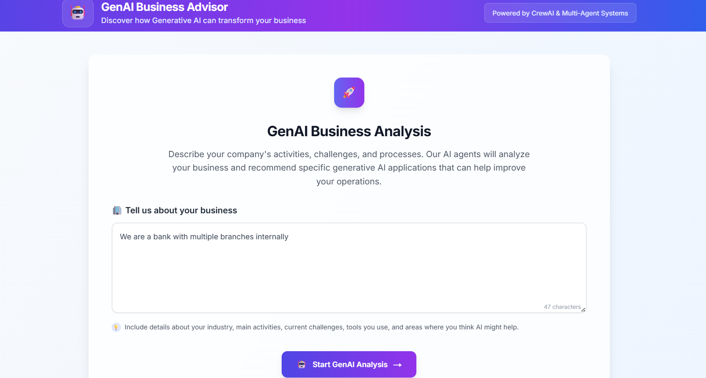
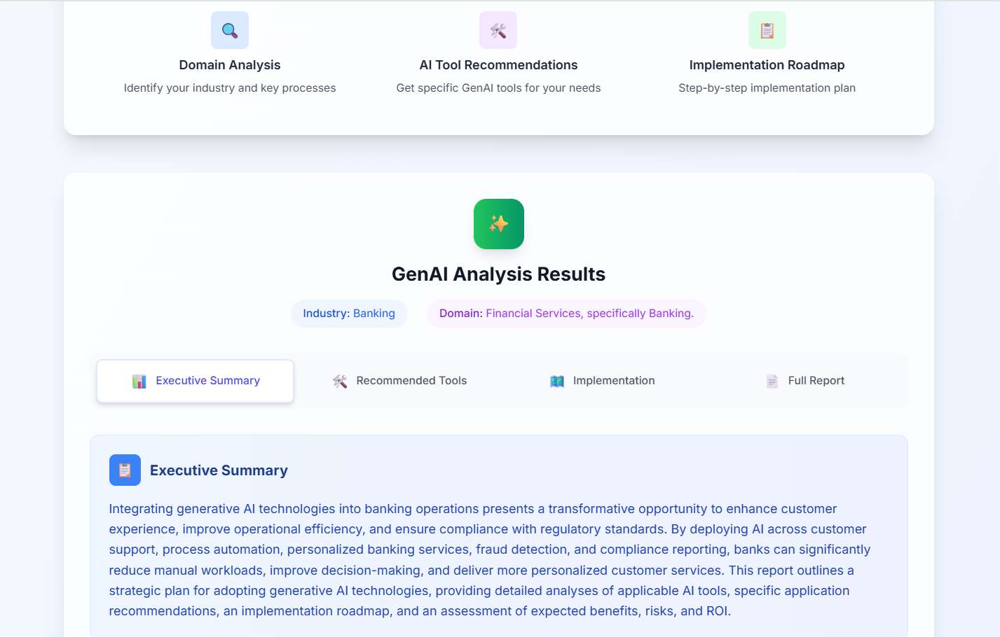
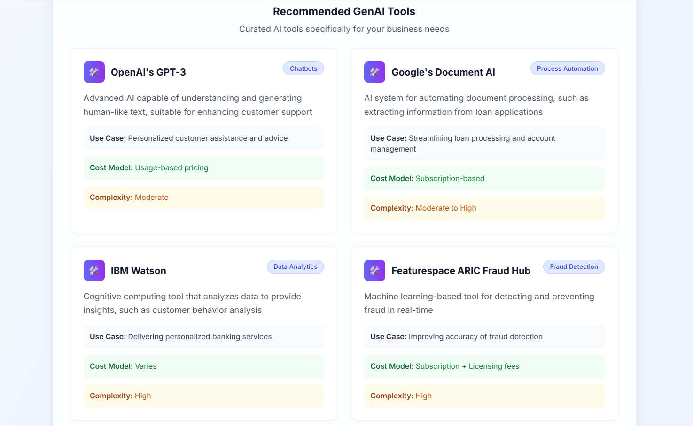
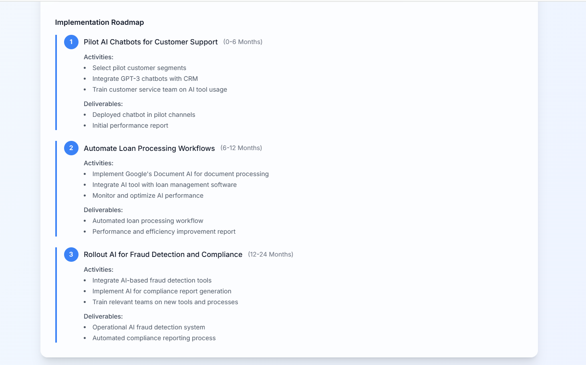
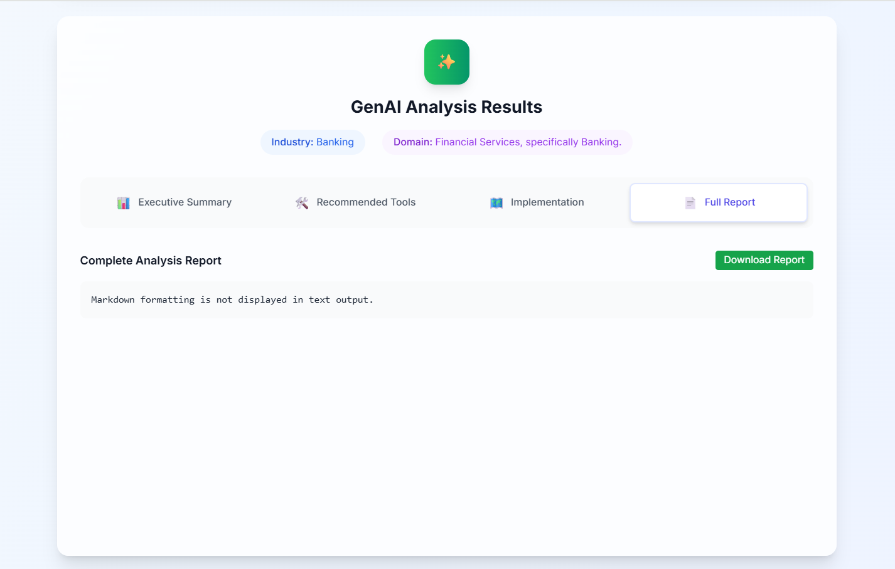
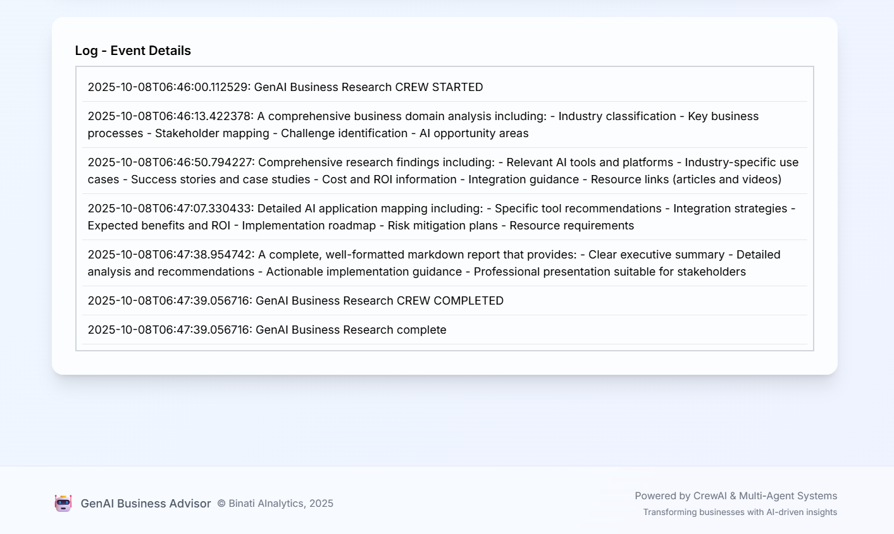

<div align="center">
  <strong></strong>

  # 🤖 GenAI Business Advisor

  _By **BINATI AInalytics**_
</div>


> **Transform your business with AI-driven insights**

A sophisticated multi-agent system that analyzes your business operations and provides tailored recommendations for implementing Generative AI solutions. Built with CrewAI, this application uses specialized AI agents to deliver comprehensive business analysis and actionable AI integration strategies.


# Demo








## 🌟 Features

### 🔍 **Intelligent Business Analysis**
- **Domain Identification**: Automatically classifies your industry and business model
- **Process Mapping**: Identifies key business activities and workflows
- **Challenge Assessment**: Pinpoints operational pain points and inefficiencies

### 🛠️ **AI Tool Recommendations**
- **Curated Solutions**: Personalized GenAI tool recommendations
- **Cost Analysis**: Implementation costs and ROI projections
- **Complexity Assessment**: Technical difficulty and resource requirements

### 🗺️ **Implementation Roadmap**
- **Phased Approach**: Step-by-step implementation strategy
- **Timeline Planning**: Realistic project timelines and milestones
- **Success Metrics**: Measurable outcomes and KPIs

### 📊 **Professional Reporting**
- **Executive Summaries**: Business-ready analysis reports
- **Markdown Export**: Downloadable comprehensive reports
- **Visual Dashboards**: Interactive results presentation

## 🏗️ Architecture

### **Multi-Agent System**
Our application employs four specialized AI agents working in concert:

1. **🧠 Business Domain Analyzer**
   - Analyzes business descriptions
   - Identifies industry classification
   - Maps business processes and stakeholders

2. **🔬 GenAI Research Specialist**
   - Researches latest AI technologies (2024-2025)
   - Finds industry-specific applications
   - Gathers implementation case studies

3. **🎯 Application Mapper**
   - Maps AI solutions to business challenges
   - Creates integration strategies
   - Develops implementation priorities

4. **📝 Content Summarizer**
   - Synthesizes research findings
   - Creates professional reports
   - Generates actionable recommendations

### **Technology Stack**

#### **Backend**
- **Framework**: Flask (Python)
- **AI Orchestration**: CrewAI
- **LLM Integration**: OpenAI GPT-4 (via OpenRouter)
- **Search Tools**: SerperDev, Tavily, YouTube Search
- **Data Validation**: Pydantic

#### **Frontend**
- **Framework**: Next.js 14 (React)
- **Styling**: Tailwind CSS
- **Type Safety**: TypeScript
- **HTTP Client**: Axios
- **Notifications**: React Hot Toast

## 🚀 Quick Start

### **Prerequisites**
- Python 3.10-3.11
- Node.js 18+
- Poetry (Python package manager)
- npm/yarn

### **Environment Setup**

1. **Clone the repository**
   ```bash
   git clone https://github.com/CyprianFusi/genai-business-advisor.git
   cd genai-business-advisor
   ```

2. **Backend Setup**
   ```bash
   cd backend
   
   # Install dependencies
   pip install -r requirements.txt
   
   # Create environment file
   touch .env
   
   # Configure your API keys in .env
   # OPENROUTER_API_KEY=your_openrouter_key
   # SERPER_API_KEY=your_serper_key
   # TAVILY_API_KEY=your_tavily_key
   ```

3. **Frontend Setup**
   ```bash
   cd ../frontend
   
   # Install dependencies
   npm install
   
   # Build the application
   npm run build
   ```

### **Running the Application**

1. **Start the Backend**
   ```bash
   cd backend
   poetry run python api.py
   or 
   python api.py
   ```
   Backend will be available at `http://localhost:3001`

2. **Start the Frontend**
   ```bash
   cd frontend
   npm run dev
   ```
   Frontend will be available at `http://localhost:3000`

## 📖 Usage Guide

### **Step 1: Describe Your Business**
Provide a detailed description of your company including:
- Industry and business model
- Main activities and processes
- Current challenges and pain points
- Existing tools and technologies
- Areas where you think AI might help

### **Step 2: AI Analysis**
Our multi-agent system will:
- Analyze your business domain
- Research relevant AI technologies
- Map solutions to your specific needs
- Generate implementation recommendations

### **Step 3: Review Results**
Explore your personalized analysis through four comprehensive tabs:
- **📊 Executive Summary**: Key findings and recommendations
- **🛠️ Recommended Tools**: Curated AI solutions
- **🗺️ Implementation Roadmap**: Step-by-step plan
- **📄 Full Report**: Complete markdown report

### **Step 4: Download Report**
Export your complete analysis as a professional markdown report for stakeholder presentations.

## 🔧 Configuration

### **API Keys Required**
- **OpenRouter**: For GPT-4 access
- **SerperDev**: For web search capabilities
- **Tavily**: For additional search functionality
- **YouTube Data API**: For video content search

### **Environment Variables**
```env
# Backend Configuration
OPENROUTER_API_KEY=your_openrouter_api_key
SERPER_API_KEY=your_serper_api_key
TAVILY_API_KEY=your_tavily_api_key

# Optional Configuration
FLASK_ENV=development
FLASK_DEBUG=True
```

## 🎯 Use Cases

### **Small to Medium Businesses**
- Identify AI opportunities without technical expertise
- Understand implementation costs and timelines
- Get started with practical AI solutions

### **Enterprise Organizations**
- Strategic AI planning and roadmapping
- Department-specific AI recommendations
- ROI analysis for AI investments

### **Consultants & Agencies**
- Client assessment and proposal generation
- AI transformation planning
- Competitive analysis and benchmarking

## 🛣️ Roadmap

### **Version 2.0** (Coming Soon)
- [ ] Multi-language support
- [ ] Industry-specific templates
- [ ] Integration with popular business tools
- [ ] Advanced analytics and reporting

### **Version 3.0** (Future)
- [ ] Real-time collaboration features
- [ ] AI-powered implementation tracking
- [ ] Custom agent training
- [ ] Enterprise SSO integration

## 🤝 Contributing

We welcome contributions! Please see our [Contributing Guidelines](CONTRIBUTING.md) for details.

### **Development Setup**
1. Fork the repository
2. Create a feature branch (`git checkout -b feature/amazing-feature`)
3. Commit your changes (`git commit -m 'Add amazing feature'`)
4. Push to the branch (`git push origin feature/amazing-feature`)
5. Open a Pull Request

## 📄 License

This project is open source and available under the [MIT License](https://raw.githubusercontent.com/Dogfalo/materialize/master/LICENSE).

## 🙏 Acknowledgments

- **[CrewAI](https://crewai.io/)** - Multi-agent orchestration framework
- **[OpenAI](https://openai.com/)** - GPT-4 language model
- **[Next.js](https://nextjs.org/)** - React framework
- **[Tailwind CSS](https://tailwindcss.com/)** - Utility-first CSS framework

## 📞 Support

- **Documentation**: [Wiki](https://github.com/yourusername/genai-business-advisor/wiki)
- **Issues**: [GitHub Issues](https://github.com/yourusername/genai-business-advisor/issues)
- **Discussions**: [GitHub Discussions](https://github.com/yourusername/genai-business-advisor/discussions)

---

<div align="center">

**Made with ❤️ for businesses ready to embrace AI transformation**

[⭐ Star this repo](https://github.com/CyprianFusi/genai-business-advisor) • [🐛 Report Bug](https://github.com/CyprianFusi/genai-business-advisor/issues) • [✨ Request Feature](https://github.com/CyprianFusi/genai-business-advisor/issues)

</div>